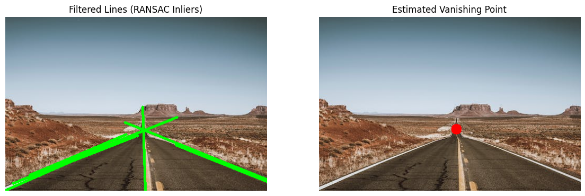
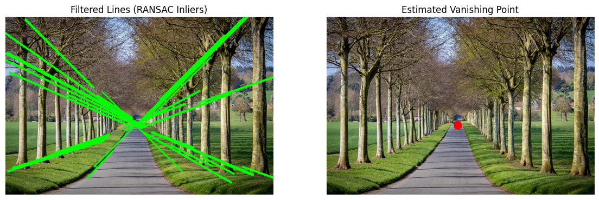
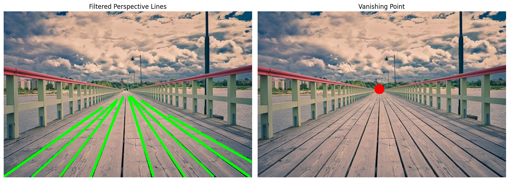

# Vanishing Point Detection using Hough Transform and RANSAC

This project detects the **vanishing point** in perspective images using classical computer vision techniques.

The implementation combines:

- Canny Edge Detection
- Probabilistic Hough Line Transform
- RANSAC (Random Sample Consensus)

The detected vanishing point is highlighted on the image along with the filtered inlier lines.

---

# Project Overview

Vanishing points are important in:

- Autonomous driving
- Lane detection
- Camera calibration
- 3D scene understanding
- Robotics
- Perspective analysis

This project estimates the dominant vanishing point from an image by detecting perspective lines and finding their intersection using RANSAC.

---

# Methodology

## 1. Image Preprocessing

- Convert image to grayscale
- Apply Gaussian blur to reduce noise
- Detect edges using Canny edge detector

## 2. Line Detection

- Detect line segments using Probabilistic Hough Transform
- Remove nearly horizontal lines

## 3. Vanishing Point Estimation

- Randomly sample line pairs
- Compute intersection points
- Use RANSAC to find the most consistent vanishing point

## 4. Visualization

- Draw inlier lines
- Mark estimated vanishing point

---

# Folder Structure

```bash
Vanishing-Point-Detection/
│
├── images/
│   └── sample.jpg
│
├── outputs/
│   └── result.png
│
├── vanishing_point_detection.py
├── requirements.txt
└── README.md
```

---

# Installation

Clone the repository:

```bash
git clone https://github.com/your-username/Vanishing-Point-Detection.git
cd Vanishing-Point-Detection
```

Install dependencies:

```bash
pip install -r requirements.txt
```

---

# Requirements

```txt
opencv-python
numpy
matplotlib
```

---

# Usage

Update the image path inside the script:

```python
image_path = "images/sample.jpg"
```

Run the program:

```bash
python vanishing_point_detection.py
```

---

# Output

The program displays:

- Filtered perspective lines
- Estimated vanishing point



---

# Sample Result

## Filtered Inlier Lines
Perspective lines detected using Hough Transform and filtered using RANSAC.

## Vanishing Point
The dominant vanishing point is marked using a red circle.

---

# Challenges Faced

- Noisy edge detection
- Incorrect Hough lines
- Parameter tuning
- Parallel line instability
- Outlier rejection

---

# Future Improvements

- Multi-vanishing-point detection
- Deep learning-based line filtering
- Real-time video processing
- Automatic parameter tuning

---

# Technologies Used

- Python
- OpenCV
- NumPy
- Matplotlib

---

# Author

Andhavarapu Jaswanth
